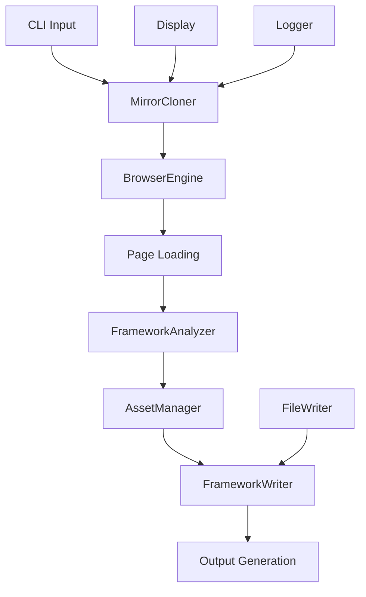

# Mirror Web CLI v1.0 — Technical Implementation Guide

This document provides comprehensive technical details about the internal architecture, algorithms, and design decisions behind Mirror Web CLI v1.0.

## 📋 Table of Contents

- [System Architecture](#️-system-architecture)
- [Core Workflow](#-core-workflow)
- [Framework Detection Engine](#-framework-detection-engine)
- [Asset Processing Pipeline](#-asset-processing-pipeline)
- [Browser Automation Strategy](#-browser-automation-strategy)
- [URL Rewriting & Path Management](#-url-rewriting--path-management)
- [Output Generation](#-output-generation)
- [Terminal UI System](#-terminal-ui-system)
- [Error Handling & Logging](#️-error-handling--logging)
- [Performance Optimizations](#-performance-optimizations)
- [Extensibility](#-extensibility)
- [Testing Guidelines](#-testing-guidelines)
- [Known Limitations](#️-known-limitations)

## 🏗️ System Architecture

### Core Module Structure

```Plaintext
src/
├── cli.js                      # CLI entry point & argument parsing
├── core/                       # Core functionality modules
│   ├── mirror-cloner.js        # Main orchestrator class
│   ├── browser-engine.js       # Puppeteer browser management
│   ├── framework-analyzer.js   # Framework detection engine
│   ├── asset-manager.js        # Asset extraction & processing
│   ├── framework-writer.js     # Output generation & structure
│   ├── display.js             # Terminal UI system
│   ├── logger.js              # Logging & warning management
│   ├── file-writer.js         # File system operations
│   ├── filename-utils.js      # Smart filename generation
│   └── server.js              # Optional static server
└── ai/                        # AI-powered analysis
    └── ai-analyzer.js         # OpenAI integration
```

### Data Flow Architecture



## 🔄 Core Workflow

### 1. Initialization Phase

```javascript
// MirrorCloner constructor
constructor(url, options = {}) {
  // URL validation and normalization
  this.url = url;
  this.baseUrl = new URL(url);
  this.domain = this.baseUrl.hostname.replace(/^www\./, '');

  // Component initialization
  this.browserEngine = new BrowserEngine(this.options);
  this.assetManager = new AssetManager(this);
  this.frameworkAnalyzer = new FrameworkAnalyzer();
  this.frameworkWriter = new FrameworkWriter(this);
  this.display = new Display();
  this.logger = new Logger(this.options);
}
```

### 2. Browser Automation Phase

```javascript
async loadPage(page) {
  // Navigate to target URL
  await page.goto(this.url, {
    waitUntil: 'domcontentloaded',
    timeout: this.options.timeout
  });

  // Wait for framework-specific elements
  await this.waitForRootReady(page);

  // Trigger lazy loading
  await this.scrollToBottomAndLoad(page);

  // Ensure assets are loaded
  await this.waitForImagesSettled(page);

  // Wait for network idle
  await this.waitForNetworkIdle(page);
}
```

### 3. Analysis Phase

```javascript
async analyze(html, url) {
  const $ = load(html);
  const detected = [];

  // Multi-method framework detection
  for (const [key, framework] of Object.entries(this.frameworks)) {
    const score = this.calculateConfidence($, framework, url);
    if (score > 0.3) { // 30% minimum confidence
      detected.push({ key, name: framework.name, confidence: score });
    }
  }

  return {
    detected: detected.sort((a, b) => b.confidence - a.confidence),
    primaryFramework: detected[0] || null,
    complexity: this.determineComplexity(detected, $)
  };
}
```

### 4. Asset Extraction Phase

```javascript
async extractAllAssets() {
  const tasks = [
    this.extractImages(),
    this.extractStylesheets(),
    this.extractScripts(),
    this.extractFonts(),
    this.extractIcons(),
    this.extractMedia()
  ];

  await Promise.all(tasks);
}
```

### 5. Output Generation Phase

```javascript
async generateOfflineProject() {
  // Build URL mapping
  this.buildAssetMapping();

  // Rewrite HTML content
  const rewrittenHtml = this.rewriteAssetUrls(this.originalHtml);

  // Generate project structure
  await this.writeProjectFiles(rewrittenHtml);

  // Download all assets
  await this.downloadAssets();
}
```

## 🔍 Framework Detection Engine

### Detection Methods

The framework analyzer uses multiple detection strategies for maximum accuracy:

#### 1. Script Source Analysis

```javascript
{ type: 'script', pattern: /_next\/static\// }  // Next.js
{ type: 'script', pattern: /vue\.js|vue\.min\.js/ }  // Vue.js
{ type: 'script', pattern: /angular\.js|angular\.min\.js/ }  // Angular
```

#### 2. DOM Element Inspection

```javascript
{ type: 'element', selector: '#__next' }  // Next.js root
{ type: 'element', selector: '#root' }   // React root
{ type: 'element', selector: '[ng-app]' }  // Angular directive
```

#### 3. Meta Tag Analysis

```javascript
{ type: 'meta', name: 'generator', pattern: /next\.js/i }
{ type: 'meta', name: 'framework', pattern: /gatsby/i }
```

#### 4. Content Pattern Matching

```javascript
{ type: 'content', pattern: /data-reactroot/i }  // React hydration
{ type: 'content', pattern: /ng-version/i }      // Angular version
```

### Confidence Scoring Algorithm

```javascript
calculateConfidence($, framework, url) {
  let score = 0;
  let totalPatterns = framework.patterns.length;

  for (const pattern of framework.patterns) {
    if (this.matchesPattern($, pattern, url)) {
      score += this.getPatternWeight(pattern.type);
    }
  }

  return Math.min(score / totalPatterns, 1.0);
}

getPatternWeight(type) {
  const weights = {
    'script': 0.4,      // High confidence
    'element': 0.3,     // High confidence
    'meta': 0.2,        // Medium confidence
    'content': 0.1      // Lower confidence
  };
  return weights[type] || 0.1;
}
```

## 🎯 Asset Processing Pipeline

### Asset Categories and Processing

#### Images

```javascript
async extractImages() {
  const images = [];

  // Standard img tags
  this.$('img[src], img[data-src]').each((i, el) => {
    const $el = this.$(el);
    const src = $el.attr('src') || $el.attr('data-src');
    if (src && $el.attr('alt')) {
      images.push({
        url: this.resolveUrl(src),
        element: 'img',
        alt: $el.attr('alt')
      });
    }
  });

  // Srcset attributes
  this.$('img[srcset], source[srcset]').each((i, el) => {
    const srcset = this.$(el).attr('srcset');
    const parsed = this.parseSrcset(srcset);
    images.push(...parsed);
  });

  // Background images in inline styles
  this.$('[style*="background"]').each((i, el) => {
    const style = this.$(el).attr('style');
    const bgImages = this.extractBackgroundImages(style);
    images.push(...bgImages);
  });

  this.assets.images = images;
}
```

#### Stylesheets

```javascript
async extractStylesheets() {
  const styles = [];

  // External stylesheets
  this.$('link[rel="stylesheet"]').each((i, el) => {
    const href = this.$(el).attr('href');
    if (href) {
      styles.push({
        url: this.resolveUrl(href),
        type: 'external'
      });
    }
  });

  // Inline styles
  this.$('style').each((i, el) => {
    const content = this.$(el).html();
    styles.push({
      content: content,
      type: 'inline'
    });
  });

  this.assets.styles = styles;
}
```

### Smart URL Resolution

```javascript
resolveUrl(url) {
  if (!url) return '';

  try {
    // Data URLs - return as-is
    if (url.startsWith('data:')) return url;

    // Absolute URLs
    if (url.startsWith('http')) return url;

    // Protocol-relative URLs
    if (url.startsWith('//')) {
      return this.baseUrl.protocol + url;
    }

    // Absolute paths
    if (url.startsWith('/')) {
      return `${this.baseUrl.protocol}//${this.baseUrl.host}${url}`;
    }

    // Relative paths
    return new URL(url, this.url).href;
  } catch (error) {
    this.logger.warn('URL resolution failed', { url, error: error.message });
    return url;
  }
}
```

## 🌐 Browser Automation Strategy

### Optimized Page Loading

#### 1. Framework Root Detection

```javascript
async waitForRootReady(page) {
  try {
    await page.waitForFunction(() => {
      const roots = ['#__next', '#root', '#app', '[ng-app]'];
      for (const selector of roots) {
        const element = document.querySelector(selector);
        if (element && element.children && element.children.length > 0) {
          return true;
        }
      }
      return document.readyState === 'complete';
    }, { timeout: 20000 });
  } catch (error) {
    this.logger.warn('Framework root readiness timeout');
  }
}
```

#### 2. Lazy Loading Trigger

```javascript
async scrollToBottomAndLoad(page) {
  await page.evaluate(() => {
    return new Promise((resolve) => {
      let lastHeight = 0;
      let sameCount = 0;

      const tick = () => {
        window.scrollTo(0, document.body.scrollHeight);
        const currentHeight = document.body.scrollHeight;

        if (currentHeight > lastHeight) {
          lastHeight = currentHeight;
          sameCount = 0;
          setTimeout(tick, 300);
        } else {
          sameCount++;
          if (sameCount < 5) {
            setTimeout(tick, 300);
          } else {
            window.scrollTo(0, 0);
            resolve();
          }
        }
      };

      tick();
    });
  });
}
```

#### 3. Image Loading Verification

```javascript
async waitForImagesSettled(page, maxWait = 8000) {
  try {
    await page.waitForFunction(() => {
      const images = Array.from(document.images || []);
      if (images.length === 0) return true;

      return images.every(img => {
        const isComplete = img.complete && img.naturalWidth > 0;
        const hasSrc = !!img.currentSrc || !!img.getAttribute('src');
        return isComplete || hasSrc;
      });
    }, { timeout: maxWait });
  } catch (error) {
    // Continue anyway - some images may still be loading
  }
}
```

## 🔗 URL Rewriting & Path Management

### Asset Filename Generation

```javascript
function makeAssetFilename(url, category = 'bin') {
  try {
    const urlObj = new URL(url);
    const pathname = urlObj.pathname;

    // Extract base name
    const segments = pathname.split('/').filter(Boolean);
    let baseName = segments.pop() || 'asset';

    // Remove query parameters from name
    baseName = baseName.split('?')[0].split('#')[0];

    // Sanitize filename
    baseName = baseName.replace(/[^a-zA-Z0-9._-]/g, '_');

    // Generate hash for uniqueness
    const hash = createHash('sha1').update(url).digest('hex').slice(0, 8);

    // Determine extension
    const ext = getExtensionByCategory(baseName, category);

    // Build final filename
    const nameWithoutExt = baseName.replace(/\.[^.]*$/, '');
    return `${nameWithoutExt}_${hash}.${ext}`;
  } catch (error) {
    const hash = createHash('sha1').update(url).digest('hex').slice(0, 8);
    return `asset_${hash}.bin`;
  }
}
```

### Global HTML Rewriting

```javascript
rewriteAssetUrls(html) {
  let rewritten = html;

  // Rewrite all mapped URLs
  for (const [originalUrl, localPath] of this.urlMapping.entries()) {
    // Multiple contexts where URLs might appear
    const patterns = [
      new RegExp(`src=["']${escapeRegex(originalUrl)}["']`, 'g'),
      new RegExp(`href=["']${escapeRegex(originalUrl)}["']`, 'g'),
      new RegExp(`url\\(["']?${escapeRegex(originalUrl)}["']?\\)`, 'g'),
      new RegExp(escapeRegex(originalUrl), 'g')
    ];

    patterns.forEach(pattern => {
      rewritten = rewritten.replace(pattern, (match) => {
        return match.replace(originalUrl, localPath);
      });
    });
  }

  return rewritten;
}
```

## 📁 Output Generation

### Project Structure Creation

```javascript
async generateOfflineProject() {
  const structure = {
    'index.html': this.rewrittenHtml,
    'package.json': this.generatePackageJson(),
    'README.md': this.generateReadme(),
    'server.js': this.generateServer(),
    'assets/': {
      'images/': {},
      'css/': {},
      'js/': {},
      'fonts/': {},
      'icons/': {},
      'media/': {}
    }
  };

  await this.writeStructure(this.options.outputDir, structure);
  await this.downloadAllAssets();
}
```

### Package.json Generation

```javascript
generatePackageJson() {
  return JSON.stringify({
    name: `mirrored-${this.domain}`,
    version: '1.0.0',
    description: `Mirrored website from ${this.url}`,
    type: 'module',
    scripts: {
      start: 'node server.js',
      serve: 'python -m http.server 8000'
    },
    metadata: {
      originalUrl: this.url,
      mirroredAt: new Date().toISOString(),
      framework: this.analysis?.primaryFramework?.name || 'Unknown',
      toolVersion: '1.0.0'
    }
  }, null, 2);
}
```

## 🎨 Terminal UI System

### Modern Display Architecture

```javascript
class Display {
  constructor(options = {}) {
    this.options = {
      version: options.version || 'v1.0',
      animations: options.animations !== false,
      width: clamp(process.stdout.columns || 100, 60, 120),
      compact: !!options.compact,
    };

    // Animation state
    this._spinnerTimer = null;
    this._spinnerFrame = 0;
    this._activeSpinnerText = '';
  }

  // Gradient text generation
  _gradientLine(text, offset = 0) {
    const chars = [...stripAnsi(String(text))];
    const n = Math.max(1, chars.length);

    return chars
      .map((ch, i) => {
        const t = (i + offset) / (n - 1 || 1);
        const color = lerpHSL(Theme.grad.from, Theme.grad.to, t);
        const hex = hslToHex(color.h, color.s, color.l);
        return chalk.hex(hex)(ch);
      })
      .join('');
  }
}
```

### Professional Progress Cards

```javascript
step(index, total, title, subtitle = '') {
  const width = this.options.width;
  const line = `${Theme.accent(Icons.step)} ${Theme.text(
    `Step ${index}/${total}`
  )}  ${Theme.muted('•')}  ${Theme.text(title)}`;

  console.log(Theme.border(borderTop(width)));
  console.log('  ' + line);
  if (subtitle) console.log('  ' + Theme.muted(subtitle));
  console.log(Theme.border(borderBottom(width)));

  // Start animated spinner
  if (this.options.animations) {
    this._startSpinner(`${Icons.play} ${subtitle || title}`);
  }
}
```

## 🛡️ Error Handling & Logging

### Intelligent Warning Suppression

```javascript
class Logger {
  constructor(options = {}) {
    this.suppressionRules = [
      // Non-critical domains
      { type: 'domain', pattern: /google\.com|googleapis\.com|gstatic\.com/ },

      // Non-critical URL patterns
      { type: 'url', pattern: /\/favicon|\/s2\/favicons|\/xjs\/_\/js\// },

      // Asset categories
      { type: 'category', values: ['icon', 'tracking', 'analytics'] },
    ];

    this.suppressedCount = 0;
    this.suppressedCategories = new Map();
  }

  shouldSuppress(level, category, message, context = {}) {
    if (!this.options.suppressWarnings || level === 'error') return false;

    for (const rule of this.suppressionRules) {
      if (this.matchesRule(rule, { category, message, context })) {
        this.suppressedCount++;
        this.suppressedCategories.set(
          category,
          (this.suppressedCategories.get(category) || 0) + 1,
        );
        return true;
      }
    }

    return false;
  }
}
```

## ⚡ Performance Optimizations

### Concurrent Asset Processing

```javascript
async downloadAssets() {
  const chunks = this.chunkArray(Array.from(this.urlMapping.entries()), 5);

  for (const chunk of chunks) {
    await Promise.all(chunk.map(([url, localPath]) =>
      this.downloadSingleAsset(url, localPath)
    ));
  }
}

async downloadSingleAsset(url, localPath) {
  try {
    const response = await fetch(url, {
      headers: {
        'User-Agent': 'Mozilla/5.0 (compatible; MirrorWebCLI/1.0)',
        'Accept': this.getAcceptHeader(localPath),
        'Referer': this.url
      },
      timeout: 30000
    });

    if (response.ok) {
      const buffer = await response.buffer();
      await this.fileWriter.writeAsset(localPath, buffer);
    }
  } catch (error) {
    this.logger.warn('Asset download failed', { url, error: error.message });
  }
}
```

### Memory Management

```javascript
// Stream large files instead of loading into memory
async processLargeAsset(url, localPath) {
  const response = await fetch(url);
  const writer = this.fileWriter.createWriteStream(localPath);

  return new Promise((resolve, reject) => {
    response.body.pipe(writer);
    writer.on('finish', resolve);
    writer.on('error', reject);
  });
}
```

## 🔧 Extensibility

### Adding New Framework Detection

```javascript
// In framework-analyzer.js
this.frameworks.myframework = {
  name: 'My Framework',
  patterns: [
    { type: 'script', pattern: /myframework\.js/ },
    { type: 'element', selector: '#my-app' },
    { type: 'meta', name: 'generator', pattern: /myframework/i },
    { type: 'content', pattern: /data-my-framework/ },
  ],
  complexity: 'MEDIUM',
};
```

### Custom Asset Processors

```javascript
// In asset-manager.js
async extractCustomAssets() {
  const customAssets = [];

  this.$('[data-custom-asset]').each((i, el) => {
    const assetUrl = this.$(el).attr('data-custom-asset');
    if (assetUrl) {
      customAssets.push({
        url: this.resolveUrl(assetUrl),
        type: 'custom',
        element: el.tagName.toLowerCase()
      });
    }
  });

  this.assets.custom = customAssets;
}
```

## 🧪 Testing Guidelines

### Unit Testing Strategy

```javascript
// Example test for framework detection
describe('FrameworkAnalyzer', () => {
  test('detects Next.js with high confidence', () => {
    const html = `
      <div id="__next">
        <script src="/_next/static/chunks/main.js"></script>
        <meta name="generator" content="Next.js">
      </div>
    `;

    const analyzer = new FrameworkAnalyzer();
    const result = analyzer.analyze(html, 'https://example.com');

    expect(result.primaryFramework.name).toBe('Next.js');
    expect(result.primaryFramework.confidence).toBeGreaterThan(0.8);
  });
});
```

### Integration Testing

```javascript
// Test complete mirroring workflow
describe('Mirror Integration', () => {
  test('mirrors simple website successfully', async () => {
    const cloner = new MirrorCloner('https://httpbin.org/html', {
      outputDir: './test-output',
      debug: false,
    });

    const success = await cloner.clone();
    expect(success).toBe(true);

    // Verify output structure
    expect(fs.existsSync('./test-output/index.html')).toBe(true);
    expect(fs.existsSync('./test-output/package.json')).toBe(true);
  });
});
```

### Performance Testing

```javascript
// Benchmark asset processing
describe('Performance', () => {
  test('processes 100 assets within time limit', async () => {
    const start = Date.now();

    const manager = new AssetManager(mockCloner);
    await manager.extractAllAssets();

    const duration = Date.now() - start;
    expect(duration).toBeLessThan(5000); // 5 seconds
  });
});
```

## ⚠️ Known Limitations

### Technical Constraints

1. **Dynamic Content**: Content generated after initial page load may not be captured
2. **Authentication**: Password-protected or session-based content cannot be mirrored
3. **Geo-restrictions**: Location-specific content may not be accessible
4. **Rate Limiting**: Some sites may block or throttle automated requests
5. **JavaScript Frameworks**: Complex state management may not function offline

### Workarounds and Solutions

```javascript
// Handle authentication (manual setup required)
const cloner = new MirrorCloner(url, {
  cookies: 'auth_token=abc123; session_id=xyz789',
  headers: {
    Authorization: 'Bearer token123',
  },
});

// Handle rate limiting
const cloner = new MirrorCloner(url, {
  requestDelay: 1000, // 1 second between requests
  timeout: 300000, // 5 minute timeout
});
```

### Browser Compatibility

- **Puppeteer Requirements**: Chromium-based browser automation
- **Node.js Version**: Requires Node.js 18+ for optimal performance
- **Memory Usage**: Large sites (>1000 assets) may require 2GB+ RAM

## 🚀 Future Enhancements

### Planned Features

1. **Incremental Updates**: Re-mirror only changed content
2. **Multi-page Crawling**: Follow links and mirror entire sites
3. **Advanced Framework Support**: Better handling of complex state management
4. **Plugin System**: Third-party extensions for custom processing
5. **Cloud Integration**: Direct upload to CDN/cloud storage

### Performance Improvements

1. **HTTP/2 Support**: Utilize multiplexing for faster downloads
2. **Compression**: Built-in asset compression and optimization
3. **Caching**: Intelligent caching of unchanged assets
4. **Parallel Processing**: Multi-threaded asset processing

---

This implementation guide provides the foundation for understanding, maintaining, and extending Mirror Web CLI v1.0. For specific questions or contributions, please refer to the project repository and documentation.
